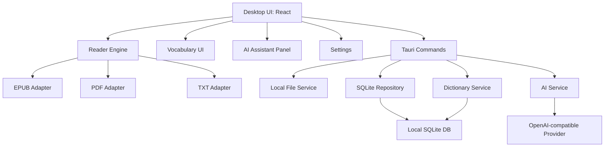
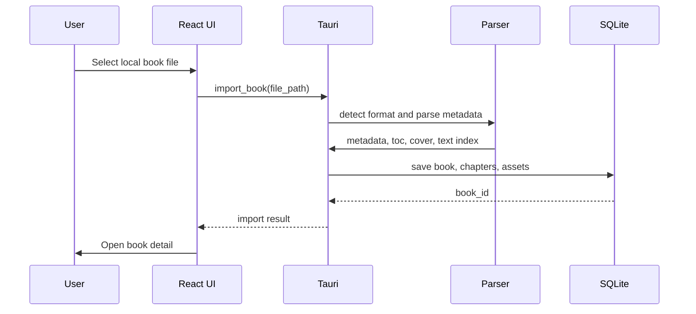
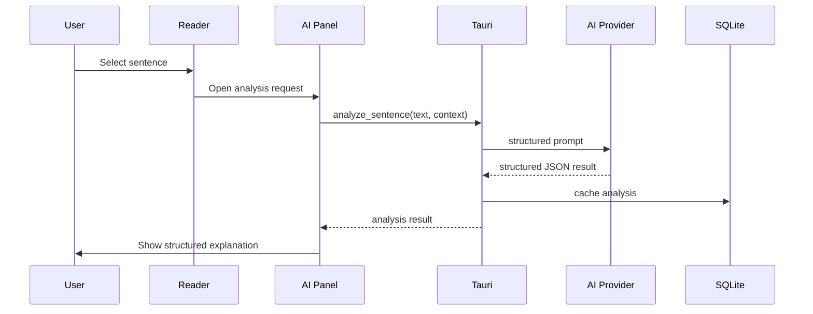
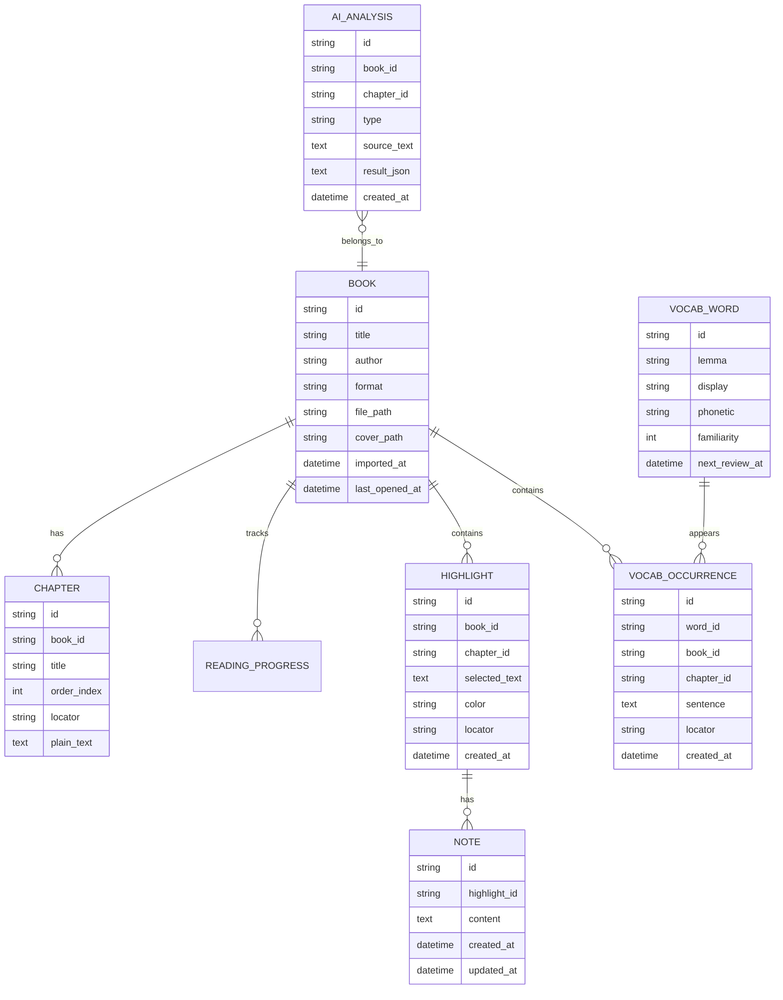

# AI 英语精读阅读器桌面版开发文档

版本：v0.1  
日期：2026-05-22  
项目定位：个人使用的桌面端 AI 英语精读阅读器

## 1. 项目概述

本项目是一款面向个人外文书阅读的桌面软件。它不是普通电子书阅读器的简单复刻，而是围绕英语学习场景，把“导入英文书籍、沉浸阅读、查词、收藏生词、长难句分析、AI 训练和复习”串成一个连续体验。

第一版优先服务个人使用，不追求账号体系、商业化、多用户协作和复杂云同步。重点是把本地阅读体验和 AI 学习能力做扎实。

### 1.1 核心目标

- 支持导入市场上常见的外文书文件。
- 提供稳定、舒适的桌面阅读体验。
- 支持对单词进行快速释义、收藏和复习。
- 支持对句子、段落进行 AI 长难句分析和英语学习训练。
- 尽量本地保存个人书库、阅读进度、生词、笔记和 AI 历史。
- 为后续扩展移动端、云同步、会员体系保留架构空间。

### 1.2 目标用户

当前目标用户：项目所有者本人。

使用场景：

- 阅读热门英文原版书、小说、非虚构作品、商业书、科普书。
- 需要在阅读时理解陌生词、复杂句、文化背景和章节主旨。
- 希望沉淀生词，并能按照学习计划复习。
- 希望 AI 偏“英语学习教练”，不是只做整段翻译。

### 1.3 产品关键词

- 桌面软件
- 本地书库
- 英语精读
- AI 长难句分析
- 上下文查词
- 生词本
- 阅读训练
- 隐私优先

## 2. 产品边界

### 2.1 第一版必须做

第一版 MVP 只做真正影响核心体验的功能：

- 本地导入书籍。
- 支持 EPUB、PDF、TXT 三种格式。
- 书库列表。
- 阅读器主界面。
- 目录、翻页、字体大小、阅读进度。
- 双击/划选单词查词。
- 单词释义包含上下文含义。
- 收藏单词到生词本。
- 划选句子进行 AI 长难句分析。
- 划选段落进行 AI 总结和理解辅助。
- 生词本列表。
- 简单复习模式。
- 本地 SQLite 存储。
- AI 接口配置页。

### 2.2 第一版可以延后

以下功能先不进入 MVP，避免第一版膨胀：

- 用户注册和登录。
- 云同步。
- 手机 App。
- 商业化订阅。
- OCR 扫描 PDF 识别。
- Kindle DRM 文件解析。
- 多人共享书库。
- 社区笔记。
- 全自动生成完整课程。
- 浏览器插件。
- 专业排版编辑器。

### 2.3 明确不做

- 不破解 DRM。
- 不提供盗版书下载。
- 不把用户书籍全文上传到服务器做索引。
- 不做公开在线书城。
- 不承诺 AI 分析永远完全准确，界面需提示“AI 结果仅供学习参考”。

## 3. 支持格式策略

### 3.1 MVP 格式

| 格式 | 优先级 | 支持方式 | 说明 |
| --- | --- | --- | --- |
| EPUB | P0 | 完整支持 | 英文书最适合做精读，章节结构清晰，文本选择体验最好 |
| PDF | P0 | 基础支持 | 支持文本型 PDF，扫描版暂不支持 OCR |
| TXT | P0 | 基础支持 | 适合纯文本书籍和测试 |

### 3.2 后续格式

| 格式 | 优先级 | 说明 |
| --- | --- | --- |
| MOBI | P1 | 热门旧格式，但解析生态弱于 EPUB |
| AZW3 | P1 | 常见 Kindle 格式，但经常涉及 DRM |
| DOCX | P2 | 可作为文章/资料导入 |
| HTML/Markdown | P2 | 适合网页文章和笔记 |

### 3.3 DRM 处理原则

用户导入的书籍必须是用户有权阅读的本地文件。软件只解析未加密或合法可访问的文件，不实现、不内置、不引导 DRM 绕过能力。

## 4. 用户流程

### 4.1 首次使用流程

1. 用户打开桌面软件。
2. 软件显示空书库状态。
3. 用户点击“导入书籍”。
4. 选择 EPUB、PDF 或 TXT 文件。
5. 系统解析文件元数据、封面、目录和正文。
6. 书籍进入本地书库。
7. 用户打开书籍开始阅读。

### 4.2 阅读查词流程

1. 用户在阅读器中双击英文单词，或用鼠标划选一个单词。
2. 系统识别单词、词形还原和当前句子上下文。
3. 先查询本地词典缓存。
4. 如果没有上下文解释，调用 AI 生成“此处含义”。
5. 弹出词卡，显示音标、词性、中文释义、上下文含义、例句。
6. 用户点击收藏。
7. 单词保存到生词本，并记录来源书籍、章节、句子和出现位置。

### 4.3 长难句分析流程

1. 用户划选一个句子。
2. 右键或悬浮菜单点击“分析句子”。
3. 系统提取句子和所在段落作为上下文。
4. 调用 AI 进行结构分析。
5. 侧边栏展示主干、从句、修饰成分、难点词组、自然翻译和学习提示。
6. 用户可收藏该句、添加笔记，或追问“再简单点”“按雅思水平讲”。

### 4.4 生词复习流程

1. 用户进入生词本。
2. 查看按书籍、熟悉度、最近收藏时间筛选的单词。
3. 点击开始复习。
4. 系统显示单词和来源句。
5. 用户选择“认识 / 模糊 / 不认识”。
6. 系统更新熟悉度和下次复习时间。

## 5. 功能需求

### 5.1 书库

功能：

- 导入书籍文件。
- 自动读取标题、作者、封面、目录。
- 展示书籍卡片或列表。
- 显示阅读进度、最近阅读时间、生词数量。
- 支持删除书籍记录。
- 支持重新解析书籍。
- 支持按标题、作者、导入时间搜索。

验收标准：

- 导入 EPUB 后可看到标题、作者和目录。
- 导入 PDF 后可打开阅读。
- 导入 TXT 后能正确分页或滚动阅读。
- 关闭软件再打开，书库数据仍然存在。

### 5.2 阅读器

功能：

- EPUB 章节渲染。
- PDF 页面渲染。
- TXT 文本渲染。
- 字号调整。
- 行距调整。
- 浅色、米色、深色主题。
- 目录跳转。
- 书签。
- 阅读进度保存。
- 搜索当前书籍文本。

桌面交互说明：

- 桌面端不强依赖“长按”。默认交互应为双击单词、划选句子、右键菜单、快捷键。
- 如果设备支持触控，可额外支持长按单词和长按句子。

验收标准：

- 重新打开书籍时回到上次阅读位置。
- EPUB 文本选择后能准确获取选中内容。
- PDF 文本型文件可选择文字并触发菜单。
- 主题切换后阅读区域不闪烁、不丢失进度。

### 5.3 查词

功能：

- 单词识别。
- 词形还原，例如 reading -> read。
- 本地基础释义。
- AI 上下文释义。
- 音标。
- 美式/英式发音链接或本地 TTS。
- 收藏单词。
- 显示来源句子。
- 显示该词在当前书出现次数。

词卡字段：

- 原词。
- 原形。
- 音标。
- 词性。
- 常见中文释义。
- 当前语境含义。
- 来源句。
- 例句。
- 收藏按钮。
- 熟悉度。

验收标准：

- 双击单词 300ms 内出现基础词卡。
- 如果调用 AI，上下文释义可异步补全。
- 收藏后可在生词本看到该词。

### 5.4 长难句分析

功能：

- 选中句子后发起分析。
- 自动携带段落上下文。
- 输出中文自然翻译。
- 输出句子主干。
- 标注从句和修饰结构。
- 解释难点词组。
- 给出学习建议。
- 支持追问。
- 支持保存句子分析。

AI 输出结构：

- 一句话总览。
- 句子主干。
- 分层结构。
- 难点解释。
- 自然翻译。
- 学习训练题。

验收标准：

- 分析结果结构稳定，不是一整段聊天式回答。
- 支持重新生成。
- 结果和当前书籍、章节、位置绑定保存。

### 5.5 段落和章节 AI 功能

功能：

- 段落总结。
- 段落难点解释。
- 章节摘要。
- 人物、概念、背景解释。
- 根据当前段落生成阅读理解题。
- 生成词汇训练题。

第一版优先级：

- P0：段落解释、段落总结。
- P1：章节摘要。
- P2：自动测验和学习计划。

### 5.6 生词本

功能：

- 收藏单词列表。
- 按书籍筛选。
- 按熟悉度筛选。
- 查看来源句子。
- 查看 AI 上下文解释。
- 标记认识、模糊、不认识。
- 简单间隔复习。
- 导出 CSV 或 Markdown。

复习规则 MVP：

- 新词：当天复习。
- 模糊：1 天后复习。
- 认识：3 天后复习。
- 连续认识 3 次：7 天后复习。

### 5.7 笔记和高亮

MVP 简化实现：

- 高亮选中文本。
- 对高亮添加笔记。
- 查看当前书全部高亮。
- 支持导出 Markdown。

后续增强：

- AI 整理读书笔记。
- 按章节生成摘要卡片。
- 导出到 Obsidian、Notion、Anki。

### 5.8 设置

功能：

- AI 服务配置。
- 模型名称配置。
- API Key 本地保存。
- 代理地址配置。
- 是否允许发送上下文给 AI。
- 默认阅读主题。
- 数据存储位置。
- 导出和备份数据。

隐私说明：

- 书籍原文默认保存在本地。
- 只有用户主动使用 AI 功能时，选中的词、句子、段落及必要上下文才会发送给 AI 服务。
- 设置页必须明确显示这一点。

## 6. 技术方案

### 6.1 推荐技术栈

推荐方案：Tauri + React + TypeScript + SQLite。

选择理由：

- 桌面端体积比 Electron 更轻。
- 前端技术适合做 EPUB/PDF 渲染和复杂阅读交互。
- Rust/Tauri 适合处理本地文件、配置、SQLite 和系统能力。
- 后续可以复用大量 React 组件到 Web 版。

技术组成：

| 层 | 技术 | 用途 |
| --- | --- | --- |
| 桌面壳 | Tauri | 打包桌面应用、本地文件能力 |
| UI | React + TypeScript | 阅读器、书库、生词本、设置页 |
| 样式 | Tailwind CSS 或 CSS Modules | 快速构建稳定界面 |
| 状态 | Zustand | 轻量状态管理 |
| 数据库 | SQLite | 本地数据存储 |
| ORM/查询 | sqlx 或 Tauri SQL 插件 | Rust 侧访问 SQLite |
| EPUB | epub.js | EPUB 渲染、目录、位置 |
| PDF | PDF.js | PDF 渲染、文本层、选择 |
| AI 调用 | OpenAI-compatible HTTP Client | 兼容 OpenAI、第三方兼容接口、本地模型网关 |
| 本地词典 | SQLite/JSON 词库 | 快速基础释义 |

### 6.2 备选技术栈

备选方案：Electron + React + TypeScript。

适用情况：

- 希望开发速度更快。
- 对安装包大小不敏感。
- 更依赖 Node.js 生态库。

暂不推荐作为第一选择，但如果 Tauri 的 PDF/EPUB 或系统集成遇到阻碍，可以切换。

## 7. 系统架构



### 7.1 模块划分

| 模块 | 职责 |
| --- | --- |
| App Shell | 窗口、路由、全局布局 |
| Library | 书库、导入、搜索、删除 |
| Reader | EPUB/PDF/TXT 阅读、选择、目录、进度 |
| Selection | 单词/句子/段落识别、右键菜单 |
| Dictionary | 本地释义、词形还原、词卡 |
| Vocabulary | 生词收藏、熟悉度、复习 |
| AI Assistant | 查词上下文解释、长难句分析、段落总结 |
| Notes | 高亮、笔记、导出 |
| Settings | 模型、隐私、阅读偏好、备份 |
| Storage | SQLite、文件索引、缓存 |

### 7.2 数据流：导入书籍



### 7.3 数据流：AI 句子分析



## 8. 数据模型

### 8.1 主要实体



### 8.2 本地文件存储

建议目录结构：

```text
AppData/
  ai-english-reader/
    database.sqlite
    books/
      {book_id}/
        original.epub
        cover.jpg
        extracted/
    cache/
      ai/
      dictionary/
    exports/
```

Windows 默认位置：

```text
%APPDATA%/ai-english-reader/
```

开发环境可用项目内 `.dev-data/`。

## 9. AI 设计

### 9.1 AI 能力原则

- AI 输出必须结构化，方便界面展示。
- AI 不替代用户阅读，而是降低理解门槛。
- 默认发送最小必要上下文。
- 相同文本、相同任务、相同模型应缓存结果。
- 所有 AI 请求可被用户取消。
- AI 请求失败时不影响阅读器基础功能。

### 9.2 DeepSeek 接入策略

DeepSeek 作为第一版优先支持的大模型服务。它提供 OpenAI 兼容接口，应用内部仍然保留通用 `OpenAI-compatible Provider` 抽象，避免后续切换 OpenAI、通义、智谱、本地模型时重写业务逻辑。

默认配置：

| 配置项 | 建议值 |
| --- | --- |
| Provider | DeepSeek |
| Base URL | `https://api.deepseek.com` |
| 快速模型 | `deepseek-v4-flash` |
| 高质量模型 | `deepseek-v4-pro` |
| API 格式 | Chat Completions |
| 输出格式 | JSON Output |

任务分配：

| 任务 | 推荐模型 | thinking | reasoning_effort | 说明 |
| --- | --- | --- | --- | --- |
| 单词上下文释义 | `deepseek-v4-flash` | disabled | high | 要快，答案短 |
| 长难句分析 | `deepseek-v4-pro` | enabled | high | 需要结构拆解 |
| 段落解释 | `deepseek-v4-pro` | enabled | high | 需要理解上下文 |
| 章节摘要 | `deepseek-v4-pro` | enabled | high | 后续功能 |

兼容注意：

- 不要在业务代码里写死 DeepSeek，统一通过 `AiProvider` 调用。
- API Key 只保存在本地安全存储或加密配置中。
- 设置页允许用户修改 Base URL，方便接入第三方 DeepSeek 中转或本地兼容网关。
- 对 JSON 输出必须做解析校验，失败时允许重试或展示原始文本。
- `deepseek-chat` 和 `deepseek-reasoner` 属于兼容模型名，文档中不作为新项目默认值。

### 9.3 AI 任务类型

| 类型 | 输入 | 输出 | MVP |
| --- | --- | --- | --- |
| 上下文查词 | 单词 + 句子 | 当前语境释义、词性、例句 | 是 |
| 长难句分析 | 句子 + 段落 | 主干、结构、翻译、难点 | 是 |
| 段落解释 | 段落 | 摘要、难点、问题 | 是 |
| 章节摘要 | 章节文本 | 摘要、关键词、人物概念 | 否 |
| 训练题 | 段落/章节 | 选择题、填空题、答案 | 否 |

### 9.4 长难句分析提示词要求

输出必须包含：

- `overview`：一句话概括。
- `core_sentence`：句子主干。
- `structure`：分层结构数组。
- `grammar_points`：语法点数组。
- `phrases`：难点词组数组。
- `translation`：自然中文翻译。
- `learning_tip`：学习建议。
- `quiz`：一个简短训练问题。

### 9.5 成本控制

- 基础词典结果先本地返回。
- AI 只补充上下文解释。
- 句子分析和段落分析缓存。
- 设置每日 AI 请求提醒阈值。
- 可配置轻量模型和高质量模型。

## 10. UI 信息架构

### 10.1 主导航

- 书库
- 阅读
- 生词本
- 笔记
- 设置

### 10.2 阅读页布局

桌面端推荐三栏：

- 左侧：目录 / 书签 / 搜索结果，可折叠。
- 中间：阅读区域。
- 右侧：词卡 / AI 分析 / 笔记，可折叠。

阅读区域优先保持安静，不放过多解释性文案。

### 10.3 选择菜单

用户选中文本后出现浮动菜单：

- 查词
- 分析句子
- 解释段落
- 高亮
- 添加笔记
- 复制

对于单词：

- 双击默认查词。

对于多词或句子：

- 默认显示“分析句子”和“解释段落”。

## 11. 开发里程碑

### Milestone 0：项目初始化

目标：

- 建立 Tauri + React + TypeScript 项目。
- 接入 SQLite。
- 建立基础路由和布局。
- 建立开发数据目录。

验收：

- 能启动桌面窗口。
- 能写入和读取本地 SQLite。

### Milestone 1：书库和导入

目标：

- 文件选择。
- 格式识别。
- EPUB 元数据解析。
- PDF/TXT 基础导入。
- 书库列表。

验收：

- 至少可导入 3 本本地测试书。
- 关闭重启后书库仍在。

### Milestone 2：阅读器核心

目标：

- EPUB 阅读。
- PDF 阅读。
- TXT 阅读。
- 阅读进度。
- 目录跳转。
- 基础阅读设置。

验收：

- EPUB 能按章节阅读。
- PDF 能翻页。
- TXT 能滚动阅读。
- 每本书的进度独立保存。

### Milestone 3：查词和生词本

目标：

- 单词选择。
- 本地词典。
- 词卡。
- 收藏生词。
- 生词本列表。

验收：

- 双击单词展示词卡。
- 收藏后生词本可见。
- 来源句子和书籍位置保存。

### Milestone 4：AI 长难句和段落解释

目标：

- AI 配置。
- 句子分析。
- 段落解释。
- 结果缓存。
- AI 侧栏。

验收：

- 划选句子可得到结构化分析。
- 划选段落可得到摘要和难点解释。
- 断网或 API 错误时有明确错误状态。

### Milestone 5：复习、笔记和导出

目标：

- 生词复习。
- 高亮和笔记。
- Markdown/CSV 导出。
- 数据备份。

验收：

- 生词可以按熟悉度复习。
- 高亮和笔记可按书籍查看。
- 可导出生词本。

## 12. 测试计划

### 12.1 单元测试

- 文件格式识别。
- 词形还原。
- 句子边界识别。
- 复习时间计算。
- AI 响应 JSON 解析。

### 12.2 集成测试

- 导入 EPUB -> 打开 -> 保存进度。
- 查词 -> 收藏 -> 生词本展示。
- 划选句子 -> AI 分析 -> 缓存结果。
- 高亮 -> 添加笔记 -> 导出。

### 12.3 手动验收样本

需要准备测试文件：

- 1 本英文 EPUB 小说。
- 1 本英文 EPUB 非虚构书。
- 1 份文本型 PDF。
- 1 份扫描型 PDF，用于验证“不支持 OCR”的提示。
- 1 个 UTF-8 TXT 文件。
- 1 个超大 TXT 文件。

## 13. 风险和解决方案

| 风险 | 影响 | 方案 |
| --- | --- | --- |
| PDF 文本选择不稳定 | 查词和句子分析体验差 | MVP 只承诺文本型 PDF，优先优化 EPUB |
| EPUB 渲染和定位复杂 | 进度、笔记定位易错 | 使用 EPUB CFI 保存位置 |
| AI 输出不稳定 | UI 展示混乱 | 要求 JSON Schema，解析失败时回退为纯文本 |
| 词典数据质量不足 | 查词体验弱 | 本地基础词典 + AI 上下文补全 |
| AI 成本不可控 | 长期使用费用高 | 缓存、请求统计、模型分级 |
| 热门书 DRM 限制 | 用户导入失败 | 明确仅支持无 DRM 文件 |

## 14. 后续路线

### v0.2

- MOBI/AZW3 非 DRM 文件支持。
- Anki 导出。
- 章节摘要。
- 更完整的复习算法。
- 本地 TTS 发音。

### v0.3

- OCR 支持扫描 PDF。
- Obsidian/Notion 导出。
- 本地模型支持。
- 阅读统计面板。

### v1.0

- 云同步。
- 移动端。
- 多设备进度同步。
- 付费模型配置和用量控制。

## 15. 第一版完成定义

当以下条件全部满足，可认为 MVP 完成：

- 能安装并打开桌面软件。
- 能导入 EPUB、PDF、TXT。
- 能舒适阅读 EPUB。
- 能保存每本书阅读进度。
- 能双击单词查词。
- 能收藏单词并进入生词本。
- 能划选句子进行 AI 长难句分析。
- 能划选段落进行 AI 解释。
- 能本地保存所有学习记录。
- AI 配置、失败提示、隐私说明完整。
